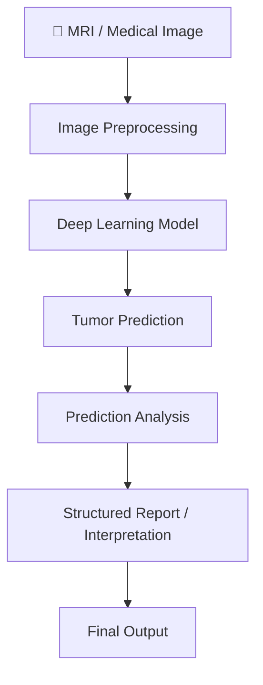
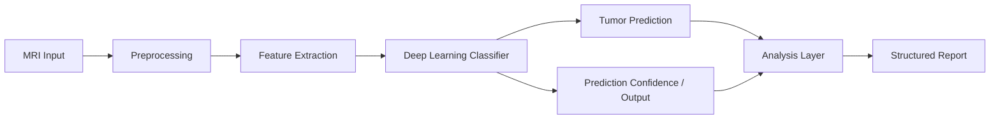

# 🧠 Advanced Brain Tumor Detection & Report Analysis Model

<p align="center">
  
  
  
  
</p>

<p align="center">
  <b>From image classification → toward structured medical-AI analysis.</b>
</p>

<p align="center">
  <a href="https://github.com/ShlokMishra01/Advanced-Brain-tumor-detection-model/blob/main/Tumor_detection_and_report_analysis_model_v_01%20(1).ipynb">
    📓 Open Notebook
  </a>
</p>

---

## 🔬 What is this?

**Advanced Brain Tumor Detection & Report Analysis Model** is a medical-imaging AI prototype designed to go beyond a conventional **tumor vs. no-tumor classifier**.

A typical beginner brain-tumor project follows:

```text
MRI Image
   ↓
CNN
   ↓
Prediction
   ↓
Tumor / No Tumor
```

This project explores a broader workflow:

```text
MRI / Medical Image
        ↓
Preprocessing
        ↓
Deep Learning Model
        ↓
Tumor Detection
        ↓
Prediction Analysis
        ↓
Structured / Report-Oriented Output
```

The objective is to make the model output more useful for **analysis, interpretation, experimentation, and future clinical-AI workflows**, rather than stopping at a single binary label.

> ⚠️ **Prototype / Research Project:** This repository is intended for experimentation and demonstration. It is not a clinical diagnostic system and should not be used for medical diagnosis or treatment decisions.

---

# ⭐ Why is this different from a basic brain tumor model?

This is the main idea behind the project.

Most introductory brain-tumor projects focus almost entirely on:

> **"Is a tumor present?"**

That is a valid classification problem, but it represents only one stage of a larger medical-analysis workflow.

This project is designed around a broader question:

> **"How can an AI system turn an imaging prediction into a more structured and useful analysis workflow?"**

### Basic Model

```text
MRI
 │
 ▼
CNN
 │
 ▼
Binary Classification
 │
 ├── Tumor
 └── No Tumor
```

### This Project

```text
                    MRI IMAGE
                        │
                        ▼
                Image Preprocessing
                        │
                        ▼
                 Deep Learning Model
                        │
                        ▼
                 Tumor Prediction
                        │
            ┌───────────┴───────────┐
            ▼                       ▼
       Model Output            Confidence/
                              Prediction Analysis
            │                       │
            └───────────┬───────────┘
                        ▼
               Structured Reporting
                 / Interpretation
```

### Core difference

| Conventional Project                              | This Project                                                |
| ------------------------------------------------- | ----------------------------------------------------------- |
| Binary classification                             | Detection + analysis workflow                               |
| Focuses on one prediction                         | Focuses on prediction + interpretation                      |
| Output is usually a label                         | Output can be organized into report-style information       |
| Primarily model-centric                           | Workflow-centric                                            |
| Demonstrates CNN classification                   | Explores a broader medical-AI pipeline                      |
| Often treated as a standalone notebook experiment | Designed as a foundation for further medical-AI development |

The key distinction is **not simply using a “bigger” neural network**.

The difference is the **scope of the workflow around the model**.

---

# 🚀 Project Highlights

| Component                   | Purpose                                             |
| --------------------------- | --------------------------------------------------- |
| 🧠 Brain MRI Analysis       | Process medical images for tumor-related prediction |
| 🔍 Tumor Detection          | Identify the predicted tumor class                  |
| 📊 Prediction Analysis      | Examine model output and confidence                 |
| 📝 Report-Oriented Output   | Organize results into a more interpretable format   |
| 🖼️ Image Preprocessing     | Prepare MRI inputs for the model                    |
| 🤖 Deep Learning            | Perform automated image analysis                    |
| 📓 Notebook Workflow        | Easy experimentation and reproduction               |
| 🔬 Research-Oriented Design | Foundation for future extensions                    |

---

# 🧬 End-to-End Workflow



The project therefore treats **classification as one component of the system**, rather than the entire product.

---

# 🧠 What the model is trying to solve

A simple classifier may return something like:

```text
Prediction: Tumor
```

A more useful analysis workflow can instead organize the model's output into a form that is easier to inspect and potentially integrate into a reporting system.

Conceptually:

```text
INPUT
MRI Image
   ↓
MODEL
Tumor Prediction
   ↓
ANALYSIS
Prediction / Confidence / Relevant Output
   ↓
REPORT
Structured Result
```

This separation between **prediction** and **report-oriented interpretation** is one of the primary ideas behind the project.

---

# 🏗️ System Architecture



### Architecture philosophy

The workflow is divided into three conceptual layers:

**1. Imaging Layer**
Processes and prepares the medical image.

**2. Prediction Layer**
Uses deep learning to generate the tumor-related prediction.

**3. Analysis Layer**
Organizes the prediction into a more interpretable report-oriented output.

---

# 🖼️ Input → Prediction → Report

```text
┌────────────────────┐
│      MRI IMAGE     │
└─────────┬──────────┘
          │
          ▼
┌────────────────────┐
│   PREPROCESSING    │
└─────────┬──────────┘
          │
          ▼
┌────────────────────┐
│   ML MODEL         │
│                    │
│ Feature Extraction │
│ + Classification   │
└─────────┬──────────┘
          │
          ▼
┌────────────────────┐
│    PREDICTION      │
└─────────┬──────────┘
          │
          ▼
┌────────────────────┐
│ REPORT / ANALYSIS  │
└────────────────────┘
```

---

# 🔍 Why report analysis matters

A model prediction alone is often difficult to use outside a pure ML experiment.

For example:

```text
"Tumor"
```

is much less informative as a system output than a structured result containing the available model output and analysis.

The project therefore explores a workflow in which the prediction becomes an input to a **structured reporting layer**.

This makes the project more extensible toward:

* medical report generation
* clinical-AI interfaces
* decision-support prototypes
* multimodal medical AI
* future radiology workflow integration

> These are **future/extension directions**, not claims that the current prototype independently provides clinical validation.

---

# 📊 Model Output

The notebook is designed around producing a model prediction from medical-image input.

A typical workflow is:

```text
Image
  ↓
Preprocessing
  ↓
Model Inference
  ↓
Predicted Class
  ↓
Prediction Analysis
  ↓
Structured Output
```

The exact output should be interpreted according to the notebook implementation and dataset used.

---

# 🧪 Research & Experimentation

The project is structured as a notebook-based experimentation environment, making it suitable for:

* model experimentation
* preprocessing experiments
* medical-image classification research
* prediction analysis
* report-generation concepts
* future model improvements

Rather than presenting the project as a finished clinical product, the repository is intended as a **research-oriented prototype** that can be extended.

---

# 🧰 Technology Stack

<p align="center">

`Python` · `TensorFlow` · `Keras` · `OpenCV` · `NumPy` · `Pandas` · `Scikit-learn` · `Matplotlib` · `Jupyter`

</p>

| Technology         | Role                        |
| ------------------ | --------------------------- |
| Python             | Core development            |
| TensorFlow / Keras | Deep learning               |
| OpenCV             | Image processing            |
| NumPy              | Numerical computation       |
| Pandas             | Data handling               |
| Scikit-learn       | ML utilities / evaluation   |
| Matplotlib         | Visualization               |
| Jupyter Notebook   | Experimentation environment |

---

# 📓 Run the Project

The main implementation is available directly as a Jupyter Notebook:

### ▶️ [Open the Model Notebook](https://github.com/ShlokMishra01/Advanced-Brain-tumor-detection-model/blob/main/Tumor_detection_and_report_analysis_model_v_01%20%281%29.ipynb)

### Install dependencies

```bash
pip install tensorflow keras opencv-python matplotlib numpy pandas scikit-learn jupyter
```

### Launch Jupyter

```bash
jupyter notebook
```

Then open:

```text
Tumor_detection_and_report_analysis_model_v_01 (1).ipynb
```

Run the notebook cells sequentially and follow the dataset/model instructions contained within it.

---

# 📁 Repository Structure

```text
Advanced-Brain-tumor-detection-model/
│
├── Tumor_detection_and_report_analysis_model_v_01 (1).ipynb
│   └── Main model and analysis notebook
│
└── README.md
```

---

# 🎯 Project Goals

The project explores how medical AI can evolve from a basic classification task into a broader analysis workflow.

### Current direction

```text
Medical Image
     ↓
AI Prediction
     ↓
Prediction Analysis
     ↓
Structured Reporting
```

### Future direction

```text
MRI
 ↓
Segmentation / Detection
 ↓
Feature Analysis
 ↓
Tumor Characterization
 ↓
Multimodal Report Analysis
 ↓
Human-in-the-loop Decision Support
```

These extensions are research directions and are not represented as completed functionality unless implemented in the repository.

---

# ⚠️ Limitations & Responsible Use

This repository is a **prototype/research project**.

It should not be interpreted as:

* a clinically validated diagnostic system
* a replacement for a radiologist or physician
* medical advice
* a certified medical device

Model performance depends on factors such as the dataset, preprocessing, image quality, training distribution, and evaluation methodology.

Any clinical deployment would require substantially more validation, appropriate datasets, expert review, regulatory consideration, and prospective testing.

---

# 💡 What makes this project interesting?

The project is intentionally moving beyond the common:

```text
Image → CNN → Tumor / No Tumor
```

pattern.

Its central design idea is:

```text
                ┌──────────────────┐
                │   MEDICAL IMAGE  │
                └────────┬─────────┘
                         ↓
                ┌──────────────────┐
                │    AI MODEL      │
                └────────┬─────────┘
                         ↓
                ┌──────────────────┐
                │    PREDICTION    │
                └────────┬─────────┘
                         ↓
                ┌──────────────────┐
                │     ANALYSIS     │
                └────────┬─────────┘
                         ↓
                ┌──────────────────┐
                │ STRUCTURED REPORT│
                └──────────────────┘
```

That shift—from **classification alone** toward **analysis and reporting around the prediction**—is the primary motivation behind the project.

---

# 📌 Project Status

**Status:** 🧪 Prototype / Research

The repository currently serves as an experimental foundation for brain-tumor image analysis and report-oriented medical-AI workflows.

---

<p align="center">

### 🧠 Medical Imaging × Deep Learning × Structured Analysis

**Built for experimentation, research, and future expansion.**

</p>
