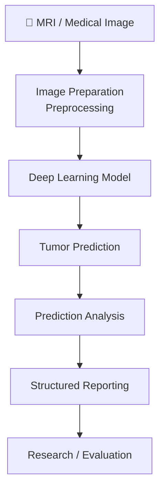
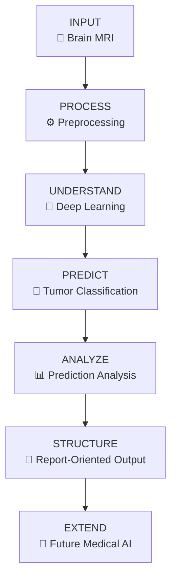

# 🧠 Advanced Brain Tumor Detection & Report Analysis

<p align="center">
  
  
  
  
</p>

<p align="center">
  <strong>From MRI classification to an analysis-oriented medical AI workflow.</strong>
</p>

<p align="center">
  A research prototype exploring automated brain-tumor detection, prediction analysis, and structured report-oriented output.
</p>

<p align="center">
  <a href="https://github.com/ShlokMishra01/Advanced-Brain-tumor-detection-model/blob/main/Tumor_detection_and_report_analysis_model_v_01%20(1).ipynb">
    📓 Open Notebook
  </a>
</p>

---

## 📄 Research / Technical Context

> ### Research-Oriented Medical AI Prototype
>
> This project explores a broader medical-imaging workflow rather than treating brain-tumor detection as a standalone binary classification problem.
>
> The implementation is organized around three stages:
>
> **Imaging → Prediction → Structured Analysis**
>
> This makes the notebook suitable as a foundation for experimentation around medical-image understanding and report-oriented AI workflows.

---

# 01 · Overview

Most introductory brain-tumor projects stop at:

```text
MRI
 │
 ▼
CNN
 │
 ▼
Tumor / No Tumor
```

This project explores a larger pipeline:

```text
                 ┌─────────────────────┐
                 │      MRI INPUT      │
                 └──────────┬──────────┘
                            │
                            ▼
                 ┌─────────────────────┐
                 │    PREPROCESSING    │
                 │  Image Preparation  │
                 └──────────┬──────────┘
                            │
                            ▼
                 ┌─────────────────────┐
                 │   DEEP LEARNING     │
                 │      INFERENCE      │
                 └──────────┬──────────┘
                            │
                            ▼
                 ┌─────────────────────┐
                 │   TUMOR PREDICTION  │
                 └──────────┬──────────┘
                            │
                ┌───────────┴───────────┐
                ▼                       ▼
      ┌─────────────────┐     ┌──────────────────┐
      │ Model Output /  │     │ Prediction       │
      │ Classification  │     │ Analysis         │
      └────────┬────────┘     └────────┬─────────┘
               └────────────┬──────────┘
                            ▼
                 ┌─────────────────────┐
                 │ STRUCTURED REPORT / │
                 │ ANALYSIS OUTPUT     │
                 └─────────────────────┘
```

The important difference is that **classification is treated as one component of the workflow rather than the complete system.**

---

# 02 · Why This Is More Than a Basic Tumor Classifier

A conventional project typically answers one question:

> **Does this image belong to the tumor class?**

That is useful, but limited.

This prototype explores the next layer:

> **How can a model prediction be organized into a more useful analysis workflow?**

### Conventional ML workflow

```text
Input
  ↓
Feature Extraction
  ↓
Classifier
  ↓
Binary Label
```

### This project's workflow

```text
Input MRI
   ↓
Image Processing
   ↓
Deep Learning Inference
   ↓
Tumor Prediction
   ↓
Prediction Analysis
   ↓
Structured Interpretation
   ↓
Report-Oriented Output
```

### Architectural distinction

| Basic Brain-Tumor Project  | This Prototype                           |
| -------------------------- | ---------------------------------------- |
| Image classification       | Image classification + analysis workflow |
| Binary output              | Prediction + organized interpretation    |
| Model-centric              | Workflow-centric                         |
| Usually ends at prediction | Extends beyond prediction                |
| Primarily demonstrates ML  | Explores medical-AI system design        |
| Limited output context     | Structured report-oriented output        |

> **The differentiator is the workflow surrounding the model, not simply claiming a more complex neural network.**

---

# 03 · System Architecture



### Pipeline layers

```text
┌─────────────────────────────────────┐
│             IMAGING LAYER           │
│ MRI → preprocessing → representation│
└──────────────────┬──────────────────┘
                   │
                   ▼
┌─────────────────────────────────────┐
│          PREDICTION LAYER           │
│      deep learning classification   │
└──────────────────┬──────────────────┘
                   │
                   ▼
┌─────────────────────────────────────┐
│           ANALYSIS LAYER            │
│ prediction → interpretation → report│
└─────────────────────────────────────┘
```

This layered structure makes the project easier to extend toward future medical-AI components.

---

# 04 · The Core Idea

### Traditional approach

```text
         MRI
          │
          ▼
     ┌──────────┐
     │  Model   │
     └────┬─────┘
          │
          ▼
     Tumor = YES
```

### Proposed analysis-oriented approach

```text
                    MRI
                     │
                     ▼
              ┌─────────────┐
              │ Deep Model  │
              └──────┬──────┘
                     │
                     ▼
              Model Prediction
                     │
          ┌──────────┴──────────┐
          │                     │
          ▼                     ▼
      Class Output        Prediction Analysis
          │                     │
          └──────────┬──────────┘
                     ▼
              Structured Result
                     │
                     ▼
                Report Layer
```

This separation creates a foundation for integrating additional analysis modules without changing the entire system architecture.

---

# 05 · Technical Pipeline

## 🧪 Stage 1 — Image Input

The workflow begins with medical-image input, primarily focused on brain MRI imagery.

```text
MRI / Medical Image
        ↓
Input Validation
        ↓
Image Preparation
```

---

## ⚙️ Stage 2 — Preprocessing

Medical images require consistent preprocessing before model inference.

Conceptually:

```text
Raw Image
   ↓
Read Image
   ↓
Resize / Normalize
   ↓
Tensor Representation
   ↓
Model Input
```

The exact preprocessing operations should follow the notebook implementation and dataset assumptions.

---

## 🧠 Stage 3 — Deep Learning Inference

The prepared image is passed through the trained deep-learning model.

```text
Preprocessed MRI
       │
       ▼
Feature Extraction
       │
       ▼
Learned Representation
       │
       ▼
Classification Head
       │
       ▼
Prediction
```

---

## 📊 Stage 4 — Prediction Analysis

Instead of immediately treating the classification output as the final product, the result becomes an input to the analysis stage.

```text
Model Prediction
       │
       ├── Class
       ├── Model Output
       └── Prediction Information
                │
                ▼
          Analysis Layer
```

---

## 📝 Stage 5 — Structured Reporting

The analysis stage organizes available model information into a more readable output.

```text
Prediction
   +
Analysis
   ↓
Structured Result
   ↓
Report-Oriented Output
```

This concept is particularly useful for future systems combining computer vision with medical-language or reporting models.

---

# 06 · What Makes the Workflow More Advanced?

The project is designed around **system-level thinking** rather than only model training.

### ① Classification is not the endpoint

The prediction is passed into a separate analysis/reporting stage.

### ② Modular architecture

The pipeline naturally separates:

```text
Image Processing
        ↓
Model Inference
        ↓
Analysis
        ↓
Reporting
```

Each stage can be improved independently.

### ③ Extensible medical-AI design

The architecture provides a foundation for adding future components such as:

```text
Segmentation
     ↓
Tumor Localization
     ↓
Feature Extraction
     ↓
Multi-modal Analysis
     ↓
Report Generation
```

These represent future extension directions rather than completed functionality unless implemented in the notebook.

---

# 07 · Model Workflow


---

# 08 · Medical-AI Design Philosophy

The project follows a simple principle:

> **A useful medical-AI system should provide more structure around a prediction than a raw class label alone.**

That leads to the following design progression:

```text
LEVEL 1
Image Classification
       ↓
"Is a tumor predicted?"

LEVEL 2
Prediction Analysis
       ↓
"What does the model output indicate?"

LEVEL 3
Structured Reporting
       ↓
"How can the output be organized for review?"

LEVEL 4
Future Multimodal Workflow
       ↓
"How can image + report + clinical context
be combined?"
```

The current repository primarily demonstrates the earlier stages of this architecture while providing a foundation for future expansion.

---

# 09 · Dataset & Evaluation

The notebook should be evaluated according to the dataset and methodology used in the implementation.

Important dimensions include:

```text
Dataset quality
        ↓
Class balance
        ↓
Image preprocessing
        ↓
Train / validation separation
        ↓
Model performance
        ↓
Generalization
```

Avoid interpreting a single accuracy value as proof of clinical usefulness.

For medical AI, evaluation should eventually consider:

* sensitivity
* specificity
* precision
* recall
* F1 score
* ROC-AUC
* external validation
* dataset shift

Only metrics actually produced by the notebook should be reported as project results.

---

# 10 · Visualizing the Concept



---

# 11 · Technology Stack

<p align="center">

`Python` · `TensorFlow` · `Keras` · `OpenCV` · `NumPy` · `Pandas` · `Scikit-learn` · `Matplotlib` · `Jupyter`

</p>

| Technology             | Purpose                     |
| ---------------------- | --------------------------- |
| **Python**             | Core implementation         |
| **TensorFlow / Keras** | Deep-learning model         |
| **OpenCV**             | Image processing            |
| **NumPy**              | Numerical operations        |
| **Pandas**             | Data handling               |
| **Scikit-learn**       | Evaluation / ML utilities   |
| **Matplotlib**         | Visualization               |
| **Jupyter**            | Interactive experimentation |

---

# 12 · Notebook

The complete prototype is currently provided as a Jupyter Notebook.

### 📓 [Open the Model Notebook →](https://github.com/ShlokMishra01/Advanced-Brain-tumor-detection-model/blob/main/Tumor_detection_and_report_analysis_model_v_01%20%281%29.ipynb)

The notebook provides the primary experimentation workflow for the project.

---

# 13 · Quick Start

### Install

```bash
pip install tensorflow keras opencv-python matplotlib numpy pandas scikit-learn jupyter
```

### Launch

```bash
jupyter notebook
```

Then open:

```text
Tumor_detection_and_report_analysis_model_v_01 (1).ipynb
```

Run the notebook sequentially and follow the dataset and execution instructions contained within it.

---

# 14 · Repository Structure

```text
Advanced-Brain-tumor-detection-model/
│
├── Tumor_detection_and_report_analysis_model_v_01 (1).ipynb
│   ├── Data preparation
│   ├── Image processing
│   ├── Model workflow
│   ├── Prediction
│   └── Analysis
│
└── README.md
```

---

# 15 · Future Architecture

The current prototype can serve as a foundation for a significantly broader medical-AI pipeline.


Potential future extensions include:

`Segmentation` · `Tumor Localization` · `Explainable AI` · `Multimodal Models` · `Report Generation` · `Human-in-the-loop Review`

---

# 16 · Prototype Status

<div align="center">

### 🧪 RESEARCH PROTOTYPE

**Current focus:**
Brain MRI analysis + deep-learning prediction + report-oriented workflow exploration

</div>

This repository should be considered an **experimental medical-AI prototype**, not a clinically validated diagnostic product.

---

# 17 · Responsible Use

⚠️ **This project is not intended for clinical diagnosis, treatment decisions, or emergency medical use.**

Machine-learning predictions can be affected by:

* dataset characteristics
* image quality
* preprocessing
* model bias
* distribution shift
* unseen cases

Any clinical deployment would require extensive external validation, clinical expert review, regulatory assessment, and prospective testing.

---

# 18 · Research Direction

The long-term direction of the project can be summarized as:

```text
             TODAY
               │
               ▼
       Brain MRI Classification
               │
               ▼
        Prediction Analysis
               │
               ▼
        Structured Reporting
               │
               ▼
             FUTURE
               │
               ▼
     Multimodal Medical AI
               │
               ▼
       Human-in-the-loop
        Decision Support
```

---

# 📄 Research Note

This repository is intended as a **research and engineering prototype** for exploring how brain-MRI classification can be integrated into a broader medical-AI analysis workflow.

The project deliberately separates:

**Model prediction**

from

**Interpretation / reporting**

which provides a more extensible architecture than a standalone classification notebook.

---

<p align="center">

### 🧠 MRI → AI → Analysis → Structured Output

**A prototype exploring the next step beyond basic medical-image classification.**

</p>
